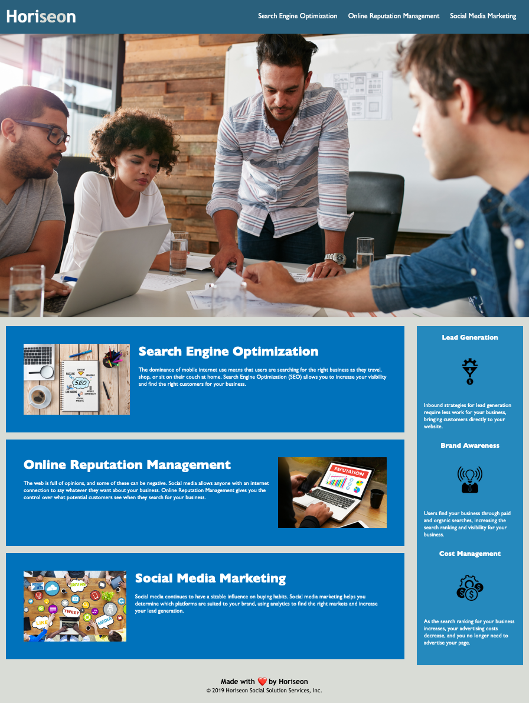

# Horiseon Service Challenge - Week 1
​
## Accessibility Optimization of Horiseon Webpage

### Live site at [Horiseon Service Challenge](https://cgsdesign.github.io/week-1-challenge/)
​
​For this project I took the pre-existing webpage for Horiseon and optimized it for greater accessibility. The original website though functional, lacked alt attributes, proper HTML elements, or a descriptive page title. It also lacked internal documentation and had repetitive classes and a lack of organization. The final page shown here, now is optimized for maximum accessibility with increased SEO. All files include relevant internal documentation, logical CSS organization, optimal use of HTML5 Elements, and clear, consolidated, classes.
​
## Key Features
* image alt atributes
* organized CSS by page flow
* concise CSS
* clear internal documentation
* semantic HTML5 elements
* title is clear and concise

## Credits
​
Base website code curtesy of uwisconsin_coding_bootcamp
​
​References: 
​https://www.pluralsight.com/guides/semantic-html

​License text curtasy of https://choosealicense.com/licenses/mit/
​
​
## License

Copyright (c) 2020 Catherine Sibley

Licensed under the MIT license.

Permission is hereby granted, free of charge, to any person obtaining a copy of this software and associated documentation files (the "Software"), to deal in the Software without restriction, including without limitation the rights to use, copy, modify, merge, publish, distribute, sublicense, and/or sell copies of the Software, and to permit persons to whom the Software is furnished to do so, subject to the following conditions:

The above copyright notice and this permission notice shall be included in all copies or substantial portions of the Software.

THE SOFTWARE IS PROVIDED "AS IS", WITHOUT WARRANTY OF ANY KIND, EXPRESS OR IMPLIED, INCLUDING BUT NOT LIMITED TO THE WARRANTIES OF MERCHANTABILITY,
FITNESS FOR A PARTICULAR PURPOSE AND NONINFRINGEMENT. IN NO EVENT SHALL THE
AUTHORS OR COPYRIGHT HOLDERS BE LIABLE FOR ANY CLAIM, DAMAGES OR OTHER
LIABILITY, WHETHER IN AN ACTION OF CONTRACT, TORT OR OTHERWISE, ARISING FROM, OUT OF OR IN CONNECTION WITH THE SOFTWARE OR THE USE OR OTHER DEALINGS IN THE SOFTWARE.
